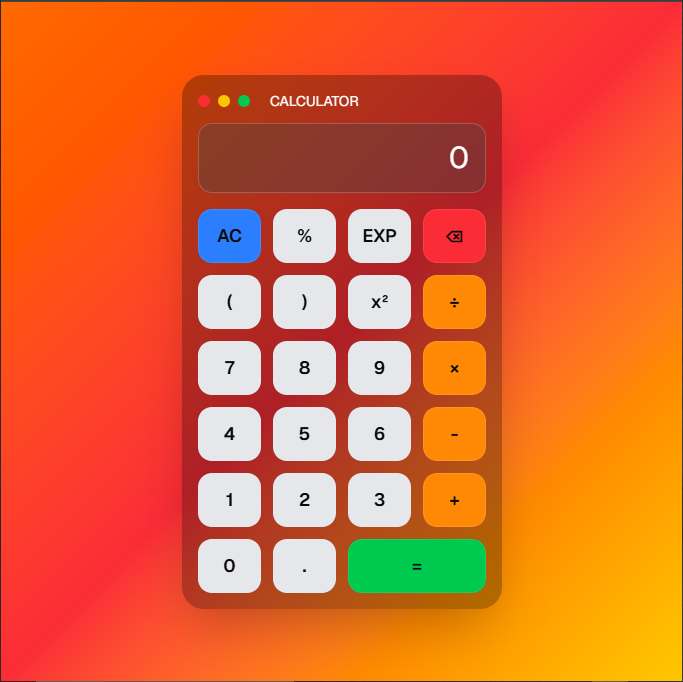

# 🧮 Calculator App

A simple and responsive Calculator built using **React**, **Vite**, **Tailwind CSS**, and **shadcn/ui**.

## ✨ Features

* Basic arithmetic operations
* Clean and responsive UI
* Fast performance with Vite
* Modern design using Tailwind CSS

## 🛠️ Tech Stack

* React
* Vite
* Tailwind CSS
* shadcn/ui
* Lucide React

## 📸 Screenshot

Add your project screenshot in an `images` folder.





## 🚀 Installation

```bash
git clone https://github.com/your-username/calculator-app.git

cd calculator-app

npm install

npm run dev
```

## 📁 Project Structure

```text
calculator-app/
│
├── public/
│   └── output.png
│
├── src/
├── package.json
└── README.md
```

## 👩‍💻 Author

**Pranali**

⭐ If you like this project, give it a star on GitHub!
